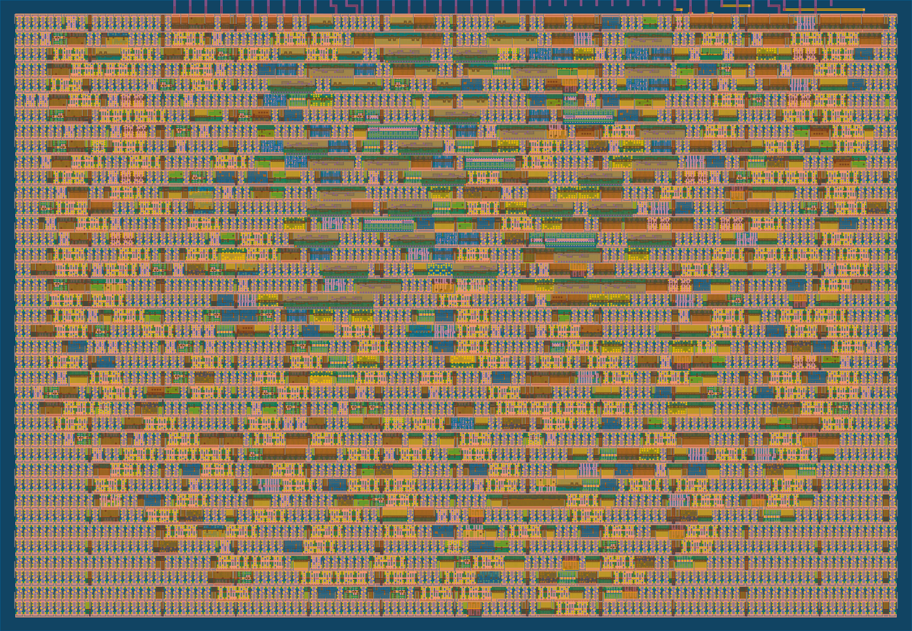
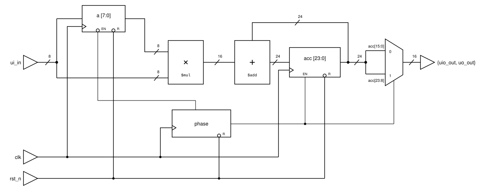
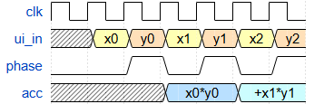

   

# int8 MAC

A multiply-accumulate unit that computes the dot product of two time-multiplexed signed int8 vectors, with its 24-bit signed accumulator sampled over two clock cycles.

[**Explore the layout in 3D**](https://gds-viewer.tinytapeout.com/?pdk=sky130A&model=https%3A%2F%2Ffwilson12.github.io%2Ftt-sky26c-mac%2F%2Ftinytapeout.oas)



## How it works

This is a single multiply-accumulate (MAC) unit, a fundamental building block of AI accelerators. Although I could only fit one MAC onto a 1x1 tile, modern accelerators like Google's TPU construct their matrix multiply units out of grids of up to 256x256 of them, called systolic arrays. Each MAC in the array is a processing element (PE) holding a stationary weight; activations are fed through one column at a time, and each PE multiplies its weight by the current activation, adds it to its incoming partial sum, and passes both the activation and its new partial sum to its neighbors. Each column produces one component of the next layer's pre-activation output, which turns out to be a pretty efficient way to multiply matrices.

Given the area constraint, I adapted the role of my MAC so it could still do useful ML math. Instead of receiving an activation from a neighboring PE and multiplying it by a stored weight, it takes two vector components at a time, multiplies them, and adds the product to a running total in an accumulator register. Basically, one MAC performs the job an entire column of systolic PEs would: computing the dot product of two vectors.

The pin constraints drove the rest of the design. Frontier accelerators work mainly with bf16, but at this scale I opted for signed int8 components. Multiplying two 8-bit operands needs 16 input bits and only 8 are available, so the operands are time-multiplexed by a two-state FSM. Reading the result has the same problem in reverse: a 24-bit accumulator doesn't fit on 8 output pins, so all 8 bidirectional pins are configured as outputs (`uio_oe = 8'hFF`) and the accumulator is sambled out over two cycles using the same phase bit.



## Interface

| Signal        | Dir | Description                                                |
| ------------- | --- | ---------------------------------------------------------- |
| `ui_in[7:0]`  | In  | Operand, signed int8 (two's complement)                    |
| `uo_out[7:0]` | Out | `acc[7:0]` in phase 0, `acc[15:8]` in phase 1              |
| `uio[7:0]`    | Out | `acc[15:8]` in phase 0, `acc[23:16]` in phase 1            |
| `clk`         | In  | One component per edge, so one pair per two edges          |
| `rst_n`       | In  | Active low synchronous reset. Clears accumulator and phase |

All 8 bidirectional pins are configured as outputs, so `uio_in` is unused

## How to test

To start a new dot product, hold `rst_n` low for at least one clock edge. This clears the accumulator and forces the FSM to phase 0.

Interleave the two vectors and present one component per rising edge: `x0, y0, x1, y1, ...`

| FSM Phase | `ui_in`                      | What happens                       | `{uio_out, uo_out}` |
| --------- | ---------------------------- | ---------------------------------- | ------------------- |
| 0         | component of vector 1 (`xn`) | captured into the operand register | `acc[15:0]`         |
| 1         | component of vector 2 (`yn`) | `acc <= acc + xn * yn`             | `acc[23:8]`         |

Sample `{uio_out, uo_out}` in phase 0 for the low two bytes, then in phase 1 for the high two; both are driven by the same accumulator value, since the accumulator only updates on the phase 1 edge. The two windows overlap by one byte, since `acc[15:8]` is driven to `uio_out` in phase 0 and on `uo_out` in phase 1. This is a consequence of reading three bytes as two 16-bit slices, which also doubles as extra validation: the testbench asserts the two copies agree, so a phase state desync surfaces instead of corrupting the result.

Note that while a component pair is being fed in, the value being driven out is the accumulator state as of the _previous_ pair.

### Reading the result

After the final pair the low half is available immediately, but an additional clock edge is needed to return the FSM to phase 1 so the high half can be sampled. That drain edge is a phase 0 edge, so it overwrites the operand register but leaves the accumulator untouched.

Reassemble the two 16-bit windows into the 24-bit accumulator:

```
acc[23:0] = ((hi16 >> 8) << 16) | lo16
```

### Example



`x = [100, -50]`, `y = [-30, 40]`, so the dot product is `100 * -30 + -50 * 40 = -5000`.

Each row is one phase interval: `ui_in` is the value presented during it, the outputs are what the design drives during it, and the behavior column is what the edge closing the interval does.

| FSM Phase | `ui_in`           | Behavior on closing edge    | `uio_out` | `uo_out` | `acc` value        |
| --------- | ----------------- | --------------------------- | --------- | -------- | ------------------ |
| 0a        | x0 = `0x64` (100) | `a <= 100`                  | `0x00`    | `0x00`   | `0x000000` (0)     |
| 1a        | y0 = `0xE2` (-30) | `acc <= acc + 100 * -30`    | `0x00`    | `0x00`   | `0x000000` (0)     |
| 0b        | x1 = `0xCE` (-50) | `a <= -50`                  | `0xF4`    | `0x48`   | `0xFFF448` (-3000) |
| 1b        | y1 = `0x28` (40)  | `acc <= acc + -50 * 40`     | `0xFF`    | `0xF4`   | `0xFFF448` (-3000) |
| 0c        | don't care        | drain edge, `acc` untouched | `0xEC`    | `0x78`   | `0xFFEC78` (-5000) |
| 1c        | don't care        | readout complete            | `0xFF`    | `0xEC`   | `0xFFEC78` (-5000) |

`hi16 = 0xFFEC`, `lo16 = 0xEC78` recombines to `0xFFEC78` => `-5000`

### Range

The accumulator is 24-bit signed, so it holds `-8388608` to `8388607`. The largest magnitude int8 product is `-128 * -128 = 16384`, so up to 511 component pairs are guaranteed not to overflow.

## Running the testbench

The [cocotb testbench](test/test.py) feeds 50 randomized vector pairs through the design and checks the readout against a Python golden model.

```
cd test
make   # RTL simulation with Icarus
make GATES=yes  # gate-level simulation against the hardened netlist
```

## More

- [Datasheet source](docs/info.md)
- [Generated datasheet](datasheet.pdf)

## Tiny Tapeout

- [Tiny Tapeout](https://tinytapeout.com)
- [FAQ](https://tinytapeout.com/faq/)
- [Digital design lessons](https://tinytapeout.com/digital_design/)
- [Submit a design](https://app.tinytapeout.com/)
